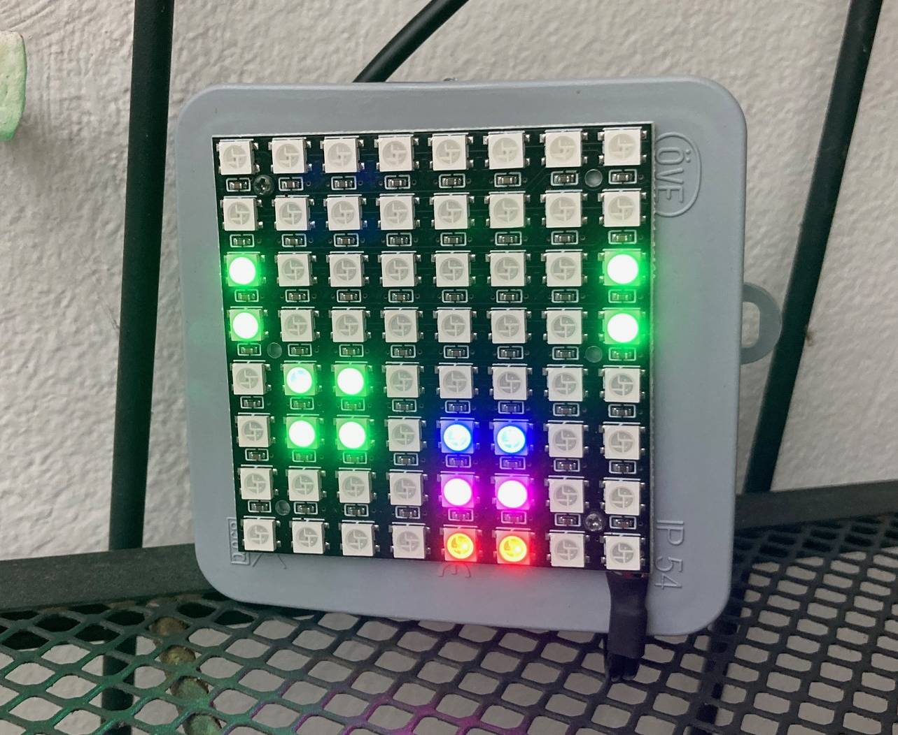

# rgb_gameoflife
Conway's [Game of Life](https://en.wikipedia.org/wiki/Conway%27s_Game_of_Life) on [Arduino Nano](https://docs.arduino.cc/hardware/nano/) projected to [8*8 WS2812B LEDs](https://www.hestore.hu/prod_10037908.html)

1. Attach the LED matrix's 3 wires to the Arduino.
   
  Vin- goes to GND
  Vin+ goes to 5V
  IN goes to D5 for example

  OUT parts remain not connected in my case.

2. Adjust the source and upload to the Arduino.

   Optionally weatherproof it and make power supply for it.

3. Show it and share the joy!

  
